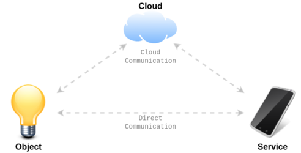
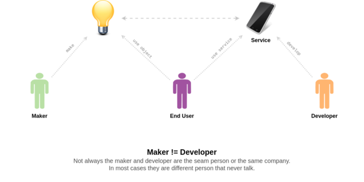
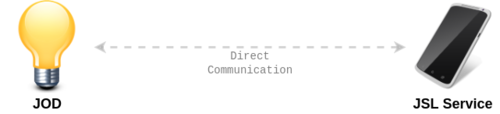
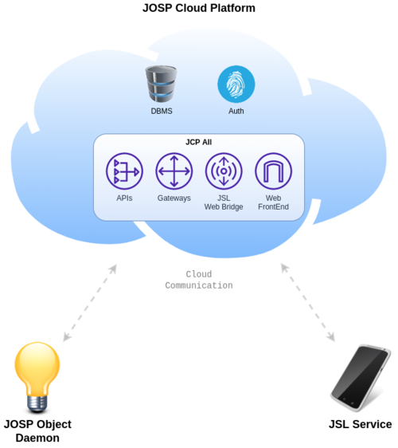

**This is the main repository of the Open Source John O.S. Project.**


* Current version: 2.2.3
* Downloads: [com.robypomper.josp / downloads @ Bitbucket](https://bitbucket.org/johnosproject_shared/com.robypomper.josp/downloads/?tab=tags)
* Repository: [com.robypomper.josp / master @ Bitbucket](https://bitbucket.org/johnosproject_shared/com.robypomper.josp/src/master/)
* Libraries: [Group Id com.robypomper.josp @ Maven Central](https://search.maven.org/search?q=g:com.robypomper.josp)
* User manuals: [ Makers](docs/manuals/makers/INDEX.md),
  [ Developers](docs/manuals/developers/INDEX.md)
  and [ End Users](docs/manuals/end_users/INDEX.md)
* References: [JOSP Components](docs/comps/INDEX.md)


**The John O.S. Project simplify the design and the build process of a modern Internet of Things solutions.**<br/>
The major benefits offered by this project when creating IoT solutions based on
the JOSP Eco-System are:

* reduces **smart object's creation into a 5 minutes** activity, even without coding skills
* it's possible **integrate any kind of connected object**, regardless of communication
  protocol used by the object
* develop **customized software that easily interact with objects**
* startups **local and cloud connections** between service and objects out-of-the-box
* provides **communication security** and object's **access control** by design
  also when not provided natively
* it is **completely Open Source**

The Public John Cloud Platform instance is reachable
[here](https://www.johnosproject.org/frontend/index.html).

**Note:** These docs are intended for JOSP developers.<br/>Other users like
[ Makers](docs/actors/makers.md),
[ Developers](docs/actors/developers.md)
and [ End Users](docs/actors/end_users.md)
can look at the
**[JOSP user manuals](docs/manuals/INDEX.md)**.

----

## Summary

* [Summary and Overview](#summary)
  * [The JOSP Project and IoT Eco-System](#the-josp-project-and-iot-eco-system)
  * [IoT Actors and Roles](#iot-actors-and-roles)
* [Getting started with source code](#getting-started-with-source-code)
  * [Setup development environment](#setup-development-environment)
  * [Local JOSP Eco-System](#local-josp-eco-system)
  * [Cloud JOSP Eco-System](#cloud-josp-eco-system)
* [Collaborate](#collaborate)
* [Versions](#versions)
* [Licences](#licences)

----

### The JOSP Project and IoT Eco-System

Thanks to the simple and flexible design of the JOSP Eco-System, became possible
**setup any kind of IoT solution**. The components that compose a JOSP Eco-System
are highly scalable and can be adapted to almost any needs. For example a simple,
local solution can use only a local communication (LAN, P2P...) so it do not require
the cloud component. On other examples there can be many objects and only one UI
the control them all; other solutions may involve different end users that require
different UIs (mobile/desktop, user/maintainer, supervisor/data collection,
brand A/brand B...).



Like any other IoT Eco-System, a JOSP Eco-System allows different software
on different machines communicate together. [Direct Communication](docs/features/communication.md#direct-communication),
if they can communicate via a local LAN; or [Cloud Communication](docs/features/communication.md#cloud-communication),
if they can both reach the cloud platform. In to the JOSP project define those
components are defined as following:

* **the [John Object Daemon](docs/comps/josp/jod/README.md)
  is the object's agent** that represent one or more physical objects. This agent
  can be run on embedded system (as [Native JOSP Object](docs/features/objects_integration.md#native-josp-objects))
  or on local servers (as [JOSP Object Hub](docs/features/objects_integration.md#hub-josp-objects)).
  It can be also run in a cloud service to create CloudToCloud integrations (as
  [JOSP Web Object](docs/features/objects_integration.md#web-josp-objects)).
  Among JOD's main tasks, there are that of sharing the capabilities of the
  object on the network, but also managing connections and access control to the
  object.

* **a JOSP Services is any software that include the [John Service Library](docs/comps/josp/jsl/README.md)**
  and then is able to monitor and/or control objects remotely. Software like
  [mobile and desktop apps](docs/features/service_integration.md#end-user-interfaces)
  can be used as UI to manage objects, [cloud services](docs/features/service_integration.md#cloud-and-ai-services)
  can collect data from objects and process them with Data Analytics and other AI
  software.

* and (only if required) **the [John Cloud Platform](docs/comps/jcp/README.md)
  that act as a bridge** between objects and services instances. The JCP service
  can handle all Object to Service communications via the public internet in a
  secure and transparent manner for the end user. Moreover, it provides also a 
  [Web FrontEnd](docs/comps/jcp/core/fe/README.md) to manage objects, users and the cloud
  itself; a [JSL Web Bridge](docs/comps/jcp/core/jslwb/README.md) implementation (used by
  web apps like the Web FrontEnd); and finally a set of [APIs](docs/comps/jcp/core/apis/README.md)
  used to coordinate all JOSP Eco-System's components. All those services can be
  run as a single SpingBoot application via the [JCP All](docs/comps/jcp/core/all/README.md)
  implementation.

### IoT Actors and Roles

All software, tools and services provided by the JOSP Project are **designed
around IoT's actors**. The complexity behind the IoT does not derive only from
the multitude of technologies used, but also from the growing number of people
who work, manage, use and ultimately maintain an IoT solution.



It doesn't matter whether the hardware or the software is created first. Simply
**decide whether to be a [
Maker](docs/actors/makers.md) or a [
Developer](docs/actors/developers.md)**. Then follow the guidelines to
develop your Object/Service as its best. **Makers will know how to share object's
capabilities** to the Eco-System and make them 'attractive' for service's Developers.
On the other side, **Developers will learn how to identify connected Objects to
interact with**, not only by name/model but also by capabilities and other details
to best suit service's purposes.

Then, **at the center of any Eco-System, there is the [
End User](docs/actors/end_users.md)**. In this group are included all peoples who 'use' the object,
both directly (physical interactions) and connectedly (digital interactions).
The main example is the owner of a smart lamp: he can switch on/off the lamp
directly via a physical switch, but he can also control the lamp through a
mobile app. Another case is about the maintainer, for example a plumber as boiler
maintainer can use his tablet to connect to the boiler and get a complete
diagnosis of it.

In the latest case, the plumber can be part of the same company that manufactured
the boiler, as Customer Service operator. That company, started as boiler's Maker,
and after selling it, the company itself becomes a boiler's End User, with the
permission of the boiler owner. That means the **roles are variable and any
Maker/Developer can follow and support hid products/services alog all their
life-cycles**.

JOSP's developers can find more info about the [JOSP Project Docs](docs/INDEX.md)
and his [development](docs/development.md) in those pages. For a rapid 
JOSP Eco-System startup, please read next chapter.

----

## Getting started with source code

To start working with JOSP project you must clone this repository via
[Git](https://git-scm.com) then, with the included [Gradle Wrapper](https://gradle.org)
you can execute project's tasks to build and run your own IoT Eco-System directly
from those sources. That require Git and Java JDK installed on your pc. And, if
you would also execute the JCP Cloud platform, then [Docker and docker-compose](https://www.docker.com)
are also required.

**Note:** These getting started is intended for JOSP developers. Other users like
[ Makers](docs/actors/makers.md),
[ Developers](docs/actors/developers.md)
and [ End Users](docs/actors/end_users.md)
can look at the **JOSP Project's User manuals
[getting started](docs/manuals/INDEX.md)**.

### Setup development environment

1. Install development tools required to download, build and run the JOSP Project:
   * [Install Git](docs/manuals/externals/development/tools.md#git-install)
   * [install Java JDK](docs/manuals/externals/development/tools.md#install-java-jdk)
   * and [install Docker and docker-compose](docs/manuals/externals/development/tools.md#install-docker-and-docker-compose)
   (Optional to run JCP Cloud)
2. Clone the com.robypomper.josp repository from [BitBucket](https://bitbucket.org)
   repository
    ```shell
    $ git clone https://bitbucket.org/johnosproject_shared/com.robypomper.josp.git
    ```
3. Enter cloned directory and start executing Gradle tasks via wrapper
    ```shell
    $ cd com.robypomper.josp
    $ ./gradlew --console=plain {TASK_NAME}
    ```
   
Now **you are ready to build and run your own IoT Eco-System**. Depending on your
needs you can configure and start up a local/cloud JOSP Eco-System. You can also
implement your JOSP service or make your JOSP Object directly from the JOSP
Project source code, but we suggest following the [ Makers](docs/manuals/makers/INDEX.md)
and [ Developers](docs/manuals/developers/INDEX.md)
manuals to make your products/services updatable and easily maintainable.

### Local JOSP Eco-System

The first, **basic IoT Eco-System** is composed only by a connected object, and
by a service to interact with. To run a basic IoT Eco-System it's required to
run the [JOD object agent](docs/comps/josp/jod/README.md),
and the shell version of the [JSL library](docs/comps/josp/jsl/README.md).



The only requirement is that both instance have to be connected to the same local network.

1. Run the John Object Daemon (JOD)
   ```shell
   $ ./gradlew javaJODRun
   ```
1. Run the John Service Library Shell (JSL Shell)
   ```shell
   $ ./gradlew javaJSLRun
   ```

That's it! **Your local IoT EcoSystem is running!**

**Communication initialization**

When executed, **the JOD agent starts and publish a local server**. At the same
time, when initialized, **the JSL library starts discovery local object**.
When the JSL library discover an object on the local network, it starts the Direct
Communication (Srv2Obj); after the SSL handshaking, the JOD agent (base on object's
permission) send his presentation messages to the service. At this point, if the
JSL service has the right permissions, can **send action command and will receive
all statuses updates to/from JOD agent**. Remember that, for security reasons, the
object's presentation messages are sent only to JSL service according to object's
access permissions.

**Interactive shells**

Once you executed both tasks on the same machine, the JSL Shell can starts
interact with the JOD Agent. Both software, the JOD and JSL Shell, provides a
shell to interact with them. Type ```?list``` to print shell's command list or check
out the [JOD Shell](docs/comps/josp/jod/specs/shell.md) and
[JSL Shell](docs/comps/josp/jsl/specs/shell.md) commands list reference.

To **stop the JOD agent or the JSL Shell**, type the ```exit``` command to the
corresponding shell or kill them via their PID.

**Gradle tasks**

Gradle's **```javaJODRun``` task run a full working instance of the JOD agent**
that represent a development object, you can [customize this object's structure](docs/comps/josp/jod/specs/structure.md)
using example structures like [struct_LINUX.jod](src/jospJOD/configs/struct_LINUX.jod)
or [struct_MAC.jod](src/jospJOD/configs/struct_MAC.jod)
or [struct_WIN.jod](src/jospJOD/configs/struct_WIN.jod) files. This task once
executed for the first time, it loads always the same JOD Object from ```envs/runnubles/jod/JOD```
dir. For other execution options see the [JOD Runners](docs/comps/josp/jod/tasks_groups.md#runner-tasks)
tasks group.

Gradle's **```javaJSLRun``` task run a shell application that implement a basic
JSL service**. This JSL service translate all JSL features in
[interactive commands](docs/comps/josp/jsl/specs/shell.md). Like for
```javaJODRun``` task, the ```javaJSLRun``` task generate his configs on first
execution and then stored them into the ```envs/runnables/jsl/JSL``` dir.
Other execution options are available at [JSL Runners](docs/comps/josp/jsl/tasks_groups.md#runner-tasks)
tasks group.

You can run first the JOD agent and second the JSL Shell or vice versa. Both
JOSP components print log messages on the console and save them on files in
their ```logs``` sub-dir. So to run multiple instances of JOD and/or JSL you
must run them in different terminals.

### Cloud JOSP Eco-System

JOD objects and JSL services can communicate directly when they are on the same
local network, or remotely via the JOSP Cloud Platform. The JCP is composed by 4
micro-services plus a DBMS and an Auth services:



* [JCP DBMS](docs/comps/jcp/docker/dbms/README.md):
  manage the DBs (jcp_auth, jcp_apis...) for other micro-services
* [JCP Auth](docs/comps/jcp/docker/auth/README.md):
  provide the authentication and authorization service
* [JCP All](docs/comps/jcp/core/all/README.md):
  The monolithic JCP Service that include all the following:
  * [JCP APIs](docs/comps/jcp/core/apis/README.md):
    basic JCP APIs required by JOSP objects and services
  * [JOSP Gateways](docs/comps/jcp/core/gws/README.md):
    the cloud gateways that acts as bridge between JOSP objects and services
  * [JOSP JSL Web Bridge](docs/comps/jcp/core/jslwb/README.md):
    the JSL's HTTP APIs manager for JSL services as web clients
  * [JOSP Front End](docs/comps/jcp/core/fe/README.md):
    the JCP front end

When an IoT Eco-System requires cloud connectivity, objects and services with
the Cloud Communication enabled can communicate together via the
John Cloud Platform that acts as a bridge. When a JSL service connect to the
JCP Gateways, it receives the object's presentations messages. So, the JSL service
know all available objects (via cloud). At the same time, when it's a JOD agent
that connects to JCP Gateways, it sends his presentation to the JCP Gateways,
that's forwarded to the connected JSL services. **Object's presentation are sent
only to JSL service according to object's access permissions.**

To **startup and shutdown all JCP micro-services** once, run one of following
Gradle's tasks: ```jospCloud_Start``` or ```jospCloud_Stop```. When are running
you can print JCP microservice's logs with following command:

```shell
$ ./gradlew jospCloud_Start
$ tail -f tail -f envs/runnables/jcp/{JCP_SERVICE}_StartAsync/jcp.log_{START_DATE_TIME}
Ctrl+C
```

To reduce time wast during microservice restart, micro-services are parted in
two groups: [Docker](docs/comps/jcp/tasks_groups.md#jcp-docker) and
[Soft](docs/comps/jcp/tasks_groups.md#jcp-soft). Each group can be started and
stopped independently to the other one. *Be careful to start up the Soft'
micro-services only when all Docker's micro-services are running*. There are
also tasks for startup and shutdown each [microservice individually](docs/comps/jcp/tasks_groups.md#jcp-services).

When the John Cloud Platform is running, you can start JOD and JSL instances
with their ```javaJODRun``` and ```javaJSLRun``` tasks. Previous tasks start
JOD and JSL instances using their default configs
([jod.yml](src/jospJOD/configs/jod_default.yml) and
[jsl.yml](src/jospJSL/configs/jsl_default.yml)) that **enable by default Local
and Cloud communications** on both components.

Once started, both JOD and JSL can be connected/disconnected to the JCP Cloud
and local communication started/stopped with corresponding shell commands
([JOD Shell's cmds](docs/comps/josp/jod/specs/shell.md) and
[JSL Shell's cmds](docs/comps/josp/jsl/specs/shell.md)).

To run the JOD and JSL components with different communication configs you can use
the tasks from [JOD Runners Alternative](docs/comps/josp/jod/tasks_groups.md#alternative)
and [JSL Runners Alternative](docs/comps/josp/jsl/tasks_groups.md#alternative).

Combining this tasks, allow you to **simulate different architectures for
different [IoT Solutions](docs/features/iot_solutions.md)**.

----

## Collaborate

**Any kind of collaboration is welcome!** This is an Open Source project, so we
are happy to share our experience with other developers, makers and users. Bug
reporting, extension development, documentation and guides etc... are activities
where anybody can help to improve this project.

One of the John O.S. Project’s goals is to release more John Objects Utils & Apps
to allow connecting even more connected objects from other standards and protocols.
Checkout the Utils & Apps extensions list and start collaborating with a development
team or create your own extension.

At the same time we are always looking for new use cases and demos. So, whether
you have just an idea or are already implementing your IoT solution, don't
hesitate to contact us. We will be happy to discuss with you about technical
decisions and help build your solution with John’s component.

Please email to [tech@johnosproject.com](mailto:tech@johnosproject.com).

----

## Versions

John Operating System Project provided software must communicate together and
with 3rd party software. To do that they use different protocols or interfaces.
Depending on the protocol or interface supported versions a software can/cannot
communicate with others. Here the protocols and interfaces versions supported by
this release. That means each software build from current source code's release
can communicate with software that also support one of following versions.

| Protocol / Interface                                             | Supported Versions |
|------------------------------------------------------------------|--------------------|
| [JOSP Protocol](docs/comps/josp/core_versions.md#josp-protocol)  | 2.0                |     1st JOSP version for JOSP>2
| [JCP APIs Ver](docs/comps/jcp/cloud_versions.md#jcp-apis)        | 2.0                |     1st JCP APIs API version for JOSP>2
| [JSL APIs Ver](docs/comps/josp/core_versions.md#jsl-apis)        | 1.0                |     1st JCP JSL Web Bridge's API version
| [JOD Executors](docs/comps/josp/core_versions.md#jod-executor)   | 2a                 |     JOSP>2 Executors>a
| [JOD Structure](docs/comps/josp/core_versions.md#jod-structure)  | 2a                 |     JOSP>2 Structure>a
| [JSL Interface](docs/comps/josp/core_versions.md#jsl-interface)  | 2.2.0              |     Same as current (?mayor?) release

All components from current source code's release are build with **2.2.3**
version.

**Older version of JOSP source code:**

* v [2.2.3](https://bitbucket.org/johnosproject_shared/com.robypomper.josp/src/2.2.3/)
* v [2.2.2](https://bitbucket.org/johnosproject_shared/com.robypomper.josp/src/2.2.2/)
* v [2.2.1](https://bitbucket.org/johnosproject_shared/com.robypomper.josp/src/2.2.1/)
* v [2.2.0](https://bitbucket.org/johnosproject_shared/com.robypomper.josp/src/2.2.0/)
* v [2.1.0](https://bitbucket.org/johnosproject_shared/com.robypomper.josp/src/2.1.0/)
* v [2.0.0](https://bitbucket.org/johnosproject_shared/com.robypomper.josp/src/2.0.0/)

----

## Licences

JOSP Project's provide different software (JOSP Components) and each one of them
have the corresponding licence. In the following table the list of JOSP Components
and their licences.

| Component          | Licence                                             |
|--------------------|-----------------------------------------------------|
| JOSP JOD           | [GPLv3](LICENSES/John Object Daemon)                |
| JOSP JSL           | [Apache Licence 2.0](LICENSES/John Service Library) |
| JCP All            | [AGPLv3](LICENSES/John Cloud Platform)              |
| JCP APIs           | [AGPLv3](LICENSES/John Cloud Platform)              |
| JCP Gateways       | [AGPLv3](LICENSES/John Cloud Platform)              |
| JCP JSL Web Bridge | [AGPLv3](LICENSES/John Cloud Platform)              |
| JCP Gateways       | [AGPLv3](LICENSES/John Cloud Platform)              |
| JCP Front End      | [AGPLv3](LICENSES/John Cloud Platform)              |

This project use different Open Source software, click here for the
[JOSP dependencies list](docs/comps/josp/external_dependencies.md) and their licences. 
