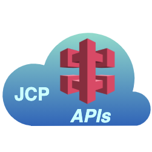

# JCP APIs

<table><tr>
<td>

</td>
<td>
The <b>John Cloud Platform APIs is the APIs manager for a JOSP EcoSystem</b>.  
All JOSP EcoSystem components can use the JCP APIs as an HTTP entry point to
handle objects, services and users on the JCP.
</td>
</tr></table>

The public JCP APIs can be reached at [api.johnosproject.org](https://api.johnosproject.org/swagger-ui.html) url.

---

**Component Info:**  
Current version: 2.2.2  
Development version: 2.3.0-DEV  
Docs: [JCP @ JOSP Docs](README.md)  
Repo: [com.robypomper.josp @ Bitbucket](https://bitbucket.org/johnosproject_shared/com.robypomper.josp/)  
Downloads: [com.robypomper.josp > Downloads @ Bitbucket](https://bitbucket.org/johnosproject_shared/com.robypomper.josp/downloads/)

**MicroService Info:**  
Port: 9001  
JCP Auth Client: jcp-apis  
JCP DBMS User: jcp_apis

---
