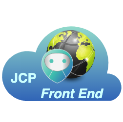

# JCP Front End

<table><tr>
<td>

</td>
<td>
The <b>John Cloud Platform Front End is the main Object's management tool for a
JOSP EcoSystem</b>.  
It allows End Users, Makers and Developers to handle their JOSP Objects and Services.
</td>
</tr></table>

The public JCP Front End can be reached at [www.johnosproject.org/frontend](https://www.johnosproject.org/frontend) url.

---

**Component Info:**  
Current version: 2.2.2  
Development version: 2.3.0-DEV  
Docs: [JCP @ JOSP Docs](README.md)  
Repo: [com.robypomper.josp @ Bitbucket](https://bitbucket.org/johnosproject_shared/com.robypomper.josp/)  
Downloads: [com.robypomper.josp > Downloads @ Bitbucket](https://bitbucket.org/johnosproject_shared/com.robypomper.josp/downloads/)

**MicroService Info:**  
Port: 9004  
JCP Auth Client: jcp-fe  
JCP DBMS User: jcp_fe

---

**The John Cloud Platform Front End provides the management Web Dashboard**,
a website where Users, Makers and Developers can manage their JOSP Objects.

This JCP Microservice is composed by a [SpringBoot](https://spring.io/projects/spring-boot)
application that provide a [Node.js](https://nodejs.org/) / [create-react-app](https://github.com/facebook/create-react-app)
application as static content.  
The main [React](https://reactjs.org/) application use the [MUI](https://mui.com/)
library as main UI components framework.

With the JCP Front End (static) application all users from a JOSP EcoSystem can
manage their JOSP Objects.  
In the web site, End User, Makers and Developers can list and check object's
activities. 
More info on how to use the JCP Front End can be found into the [End User manual](/docs/manuals/end_users/INDEX.md).

The JCP Front End expose also the [/ Entry Point](#api--entry-point) API
(implemented in the Spring side of the JCP FE). This API return the [JCP JSL Web Bridge](../jslwb)'s
public url and allow clients (like a browser) initialize a new JSL session.  
The JSL Session, must be request by the JCP FE to the JCP JSL WB, because the
JSL Session require the JOSP Service's id and secret (from the JCP FE). To keep
his credentials private, the JCP FE don't share them within the client side code.
Instead, the client require to the JCP FE to create a new JSL Session to the
JCP JSL WB on his own.

## API references

### API / Entry Point
Swagger docs: [Group > API's](https://stage.johnosproject.org/swagger-ui.html?urls.primaryName=JCP%20Front%20End#//_Entry_Point)  
Provides entrypoint url and initialize JSL Sessions

**[/getEntrypoint](https://stage.johnosproject.org/swagger-ui.html?urls.primaryName=JCP%20Front%20End#/%20/%20Entry%20Point/getEntrypointUsingGET)**   
Provides entrypoint url to the JCP Front End (static).

**[/initJSLWebBridgeSession](https://stage.johnosproject.org/swagger-ui.html?urls.primaryName=JCP%20Front%20End#/%20/%20Entry%20Point/initJSLWebBridgeSessionUsingGET)**  
Initialize JSL Sessions for the JCP Front End (static).
