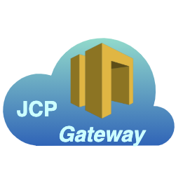

# JCP Gateways

<table><tr>
<td>

</td>
<td>
The <b>John Cloud Platform Gateways is the cloud component in a JOSP EcoSystem
that allow JOSP Objects and Services communicate via Cloud</b>.  
JOSP Objects and Services can connect to JCP Gateways asking his access info to
the JCP APIs.
</td>
</tr></table>

---

**Component Info:**  
Current version: 2.2.2  
Development version: 2.3.0-DEV  
Docs: [JCP @ JOSP Docs](README.md)  
Repo: [com.robypomper.josp @ Bitbucket](https://bitbucket.org/johnosproject_shared/com.robypomper.josp/)  
Downloads: [com.robypomper.josp > Downloads @ Bitbucket](https://bitbucket.org/johnosproject_shared/com.robypomper.josp/downloads/)

**MicroService Info:**  
Port: 9002  
JCP Auth Client: jcp-gws  
JCP DBMS User: jcp_apis

---
