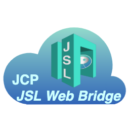

# JCP JSL Web Bridge

<table><tr>
<td>

</td>
<td>
The <b>John Cloud Platform JSL Web bridge is the HTTP APIs implementation of the
JSL library for an entire JOSP EcoSystem</b>.  
With the APIs exposed by this microservice, all API's client can create a
JSL session and interact with JOSP Objects.  
Each client (like a website) is seen from the JOSP EcoSystem as a specific
JOSP Service and not like JSL Web bridge services.
</td>
</tr></table>

The public JCP APIs can be reached at [jslwb.johnosproject.org](https://jslwb.johnosproject.org/swagger-ui.html) url.

---

**Component Info:**  
Current version: 2.2.2  
Development version: 2.3.0-DEV  
Docs: [JCP @ JOSP Docs](README.md)  
Repo: [com.robypomper.josp @ Bitbucket](https://bitbucket.org/johnosproject_shared/com.robypomper.josp/)  
Downloads: [com.robypomper.josp > Downloads @ Bitbucket](https://bitbucket.org/johnosproject_shared/com.robypomper.josp/downloads/)

**MicroService Info:**  
Port: 9003  
JCP Auth Client: jcp-jsl-web-bridge  
JCP DBMS User: n/a

---
