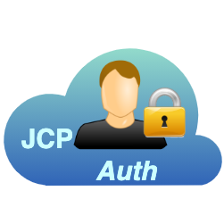

# JCP Authentication

<table><tr>
<td>

</td>
<td>
The <b>John Cloud Platform Auth service is the AAA system used by the John Cloud
Platform to authenticate user but also service, objects and even the JCP's
microservices</b>. <br/>
This service is based on a dockerization of the <a href="https://www.keycloak.org/">
Keycloak</a> AAA service.
</td>
</tr></table>

---

**Component Info:** <br/>
Current version: 14.0.0 <br/>
Development version: 20+ <br/>
Docs: [JCP @ JOSP Docs](README.md) <br/>
Repo: [com.robypomper.josp @ Bitbucket](https://bitbucket.org/johnosproject_shared/com.robypomper.josp/) <br/>
Downloads: [com.robypomper.josp > Downloads @ Bitbucket](https://bitbucket.org/johnosproject_shared/com.robypomper.josp/downloads/)

**MicroService Info:** <br/>
Port: 8998 <br/>
JCP Auth Client: n/a <br/>
JCP DBMS User: jcp_auth

---

## JCP AAA / Keycloak

This project provides the **JCP Auth Server** for development environment.

This service is based on [jboss/keycloak@DockerHub](https://hub.docker.com/r/jboss/keycloak/)
image and was customized as test Auth server for the JCP development. For this
purpose the service connects to [DBMS](../dbms/README.md)'s db ```josp_auth```.

The Auth server console is reachable at [https://localhost:8998/auth/admin/master/console/]()
and realm is ```jcp```.

## Service mngm

Like others Docker based project, it can be **started and stopped** with following cmds:
```shell
./gradlew auth_Up
./gradlew auth_Down
```

To **manage the auth server resources** (clients/user/roles/scopes) please visit
the admin console at [https://localhost:8998/auth/admin/master/console/]().

To **reset the auth server's database**, you can drop and recreate the ```jcp_auth```
database in to the DBMS service. You can connect to the DBMS with a mysql client
(like MySQL Workbench) and run following sql command, then restart the Auth server.

```sql
DROP DATABASE `jcp_auth`;
CREATE DATABASE `jcp_auth` CHARACTER SET utf8 COLLATE utf8_general_ci;    // Charset not required from version 2.1
```

## Preset configurations

The auth server for development environment come with preconfigured settings
from the [docker/import-export/import-jcp.json]() file. Each time the server
startups, it imports all data contained in [docker/import-export/import-jcp.json]().
The import file can be customized via the ```KEYCLOAK_IMPORT``` env var set in the
[docker/docker-compose.yml]() file.

It's also possible export data from existing Auth Server. Disable the
```KEYCLOAK_IMPORT``` and enable the ```KEYCLOAK_EXPORT``` env var in the
[docker/docker-compose.yml]() file. Then (re)start the auth server.
After the server startup, looks the [docker/import-export]() directory
for exported file.

Both, import and export, files use the [docker/import-export]() directory
to share files with the docker container. It can be customized simply updating
the volumes configs in the [docker/docker-compose.yml]() file.

### Preset configs includes:

**Clients:**
* test-client: support all flows
* test-client-obj: act as an object. Support Client Cred flow and ```obj``` role.
* test-client-srv: act as a service. Support Auth Code flow and ```srv``` role.
* test-client-swagger: act as swagger user because swagger support only Implicit flow. It supports also all scopes.
* jcp-fe: client used by JCP Front End [](../../core/fe/README.md). Support Auth Code flow and ```srv``` role.

**Users:**
* roby/roby: user with manager privileges (mng role)
* pinco/pinco: user with normal privileges

**Roles:**
* obj: default role for objects (set @ client-level)
* srv: default role for services (set @ client-level)
* mng: default role for management services (set @ user-level)
* removed default assigned roles offline_access and uma_authorization

**Scopes:**
* roles: allow access to user's roles
* profile: allow access to user's profile
* email: allow access to user's email

**Keycloak:**
* general configs
* login:<br>
  Enabled following settings: user registration, edit username, forgot password, remember me, verify email,
  login with email, require SSL (true)
* email:<br>
  enabled SMTP server via [mailjet.com](https://app.mailjet.com/)

**Here a table that sum up access rules:**

| User  | Client     | CliRoles | UsrRoles | Flows              | Task                  |
|-------|------------|----------|----------|--------------------|-----------------------|
| --    | Object     | obj      | --       | Client Credentials | javaClientTest_ObjRun |
| User  | Service    | srv      | --       | Auth Code          | javaClientTest_SrvRun |
| Mngr  | Service    | srv      | mng      | Auth Code          | javaClientTest_MngRun |
| Dev   | Swagger    | ALL      | --       | Implicit           |                       |
