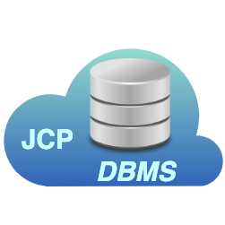

# JCP DBMS

<table><tr>
<td>

</td>
<td>
The <b>John Cloud Platform DBMS host and provide all DBs required by other JCP MicroService</b>.
This service is based on a dockerization of the <a href="https://www.mysql.com/it/">
Mysql</a> service.
</td>
</tr></table>

The JCP DBMS service should be not reachable outside the JCP's private network.

---

**Component Info:** <br/>
Current version: 8+ <br/>
Development version: 8+ <br/>
Docs: [JCP @ JOSP Docs](README.md) <br/>
Repo: [com.robypomper.josp @ Bitbucket](https://bitbucket.org/johnosproject_shared/com.robypomper.josp/) <br/>
Downloads: [com.robypomper.josp > Downloads @ Bitbucket](https://bitbucket.org/johnosproject_shared/com.robypomper.josp/downloads/)

**MicroService Info:** <br/>
Port: 8998 <br/>
JCP Auth Client: n/a <br/>
JCP DBMS User: jcp_auth

---

## JCP DBMS / MySQL

This project provide the **JCP DBMS** for development environment.

This service is based on [MySQL 5@DockerHub](https://hub.docker.com/_/mysql) image
and was customized as test DBMS for the JCP development. For this purpose the
service can be initialized with preset datasets from the ```sql``` dir.

The MySQL protocol is reachable at [mysql://localhost:8999]() and default root
password is ```root```.

## Service mngm

Like others Docker based project, it can be **started and stopped** with following cmds:
```shell
./gradlew dbms_Up
./gradlew dbms_Down
```

If you'd like to **reset the databases** to initial preset datasets, then
you should stop tha service, delete his permanent volumes and then restart the
server. During the reboot, the server will parse all files contained in
```sql/``` dir.

```shell
./gradlew dbms_Up
./gradlew dbms_Down
sudo rm -rf docker_envs/dbms/mysql/data
```

To **add a new preset dataset**, simply add sql files to ```sql/``` dir following
the filenames format:
* {DB_NAME}_A_schema.sql
* {DB_NAME}_B_data.sql
* {DB_NAME}_C_users.sql

And each file must start with the DB ``create if not exist``` line:
```sql
CREATE DATABASE IF NOT EXISTS `{DB_NAME}`;
```
Where ```DB_NAME``` must be the name of the database (MySQL schema) that contains
created preset dataset.


## Preset datasets

### test_db
Dataset for testing purposes.

It defines only the user ```test_db``` with all permissions on the dataset database.

### jcp_auth
Dataset for the [Auth](../auth/README.md) microservice.

It defines only the DB schema and users.

### jcp_apis
Dataset for the [JCP APIs](../../core/apis/README.md) microservice.

It defines only the DB schema and users.
