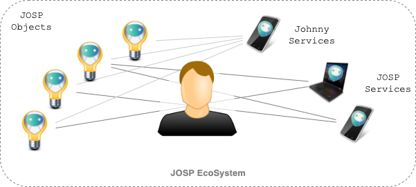

# JOSP as IoT EcoSystem

The JOSP EcoSystem would act as the point of reference for user's IoT Solutions
based on JOSP Objects and Services. Like other IoT EcoSystem, it includes all 
components required to compose IoT Solutions, that, in the JOSP Project we call
them JOSP Solutions.

A JOSP EcoSystem can support you creating different kind of IoT Solutions in
different environments. More solutions examples into JOSP EcoSystem definitions
pages:
* [Personal EcoSystem](/docs/manuals/end_users/1_design_solution/1_personal_iot_ecosystem.md)
* [Domestic](/docs/manuals/end_users/1_design_solution/2_domestic.md)
* [Professional](/docs/manuals/end_users/1_design_solution/3_professional.md)
* [Enterprise](/docs/manuals/end_users/1_design_solution/4_enterprise.md)

The smallest JOSP EcoSystem is composed by a single [JOSP Object](objects_integration.md) and a
single [JOSP Service](service_integration.md) that communicate directly via the local network.
This is also the smallest [JOSP Solution](iot_solutions.md) that you can create. 
More objects and services can be added to the same local network to create a more
complex JOSP Solutions. 
JOSP Service and Objects can communicate also when they are not on the same network,
to do that they need to connect on the same [JCP Gateway](/docs/comps/jcp/core/gws/README.md)
from the JCP Platform. That allow them to communicate also via Cloud.

The JCP Platform and all others required software to set up a JOSP EcoSystem, are
provided by the [JOSP Project](/README.md):

* the [John Object Daemon](/docs/comps/josp/jod/README.md) as object's agent
* the [John Service Library](/docs/comps/josp/jsl/README.md) and basic JOSP Services
* The [John Cloud Platform](/docs/comps/jcp/README.md) as optional component for cloud objects-service communication

In a JOSP EcoSystem, **objects and services can be easily handled by end users**.
They can buy products ready to connect an JOSP EcoSystem or, they can install the
JOD Agent by himself to integrate 3rd part connected objects. Once end user
register an object to the EcoSystem, he can choose with which JOSP Service interact
with his objects, simply as choose a software to use. In this way end users are
able to design and create their personal JOSP Solutions.

Because it's really common for IoT Solutions require also the cloud component,
within **the JOSP Project we provide also a public accessible John Cloud Platform**.
So, end users can use the [Public JCP](/docs/comps/jcp/public_jcp.md) to
connect their JOSP Objects and Services without worrying about the IoT infrastructure.
This public instance of the JCP, allow users also to easily share objects with
other users with an account on the same JCP instance.

From end user point of view, the JOSP EcoSystem act as an IoT aggregator, where
he can register and manage all his connected objects. Once an object is registered
on the JCP user's account, the user know that the object become available to all
his JOSP Services. **We call it a Personal IoT EcoSystem**. 
The Personal EcoSystem simplify the IoT management and will increase the adoption
of IoT Solution from End User without the need to require specialist advice or
expensive external procurement.

For the most demanding users and with particular regard to safety (like enterprises),
it is always possible to set up his own JCP instance. That help companies keeps
their data under control, without the need for them to transit through the
public internet.

---

## Personal IoT EcoSystem

Today, home automation users can control some of their devices via voice assistants,
others devices via physical interfaces or web portals, and still others devices
that provide only the manufacturer's mobile app. Each connected objects with his
features, his configurations and his services. 
This makes the home automation messy and confused.

Like home automation, also industrial automation, smart cities and all other IoT
Solutions consumers are struggling to adopt new technologies and one of the main
reasons is that users can’t see **a really connected world**, but instead they see
a patchwork of different systems.

From the point of view of the users, it’s required a single point of reference
where they can manage all connected objects. A single, accessible, place to list
and check objects' connectivity. Users need **a common place to manage all their
objects and all IoT related settings**. Users need a Personal IoT EcoSystem.

The John O.S. Project provides different JOSP Services ready-to-use for end users
to register, manage and interact with their JOSP Objects. For example, user can
log in to the JCP Front End or one of the official JOSP Mobile Apps and then start
managing their connected objects.

Users also encounter difficulties when they have to use specific software that
interacts with objects. Normally users should configure the integration between
the specific software and desired object’s protocol. Because of that, today's
IoT software requires their own configuration and, in addition for each object,
to set up the connection.

For example, think about a fitness application that must search via bluetooth
(or another protocol) to some training equipment. This application must configure
the bluetooth pairing (or another authentication process) and connection. With a
Personal IoT EcoSystem, the mobile app can reach all user’s training equipment
(locally and remotely) simply asking the user to log in to the IoT EcoSystem.

Behaviors like this can be handled with a Personal IoT EcoSystem that **allows
3rd party software to interact with user’s objects effortless**.

Last but not least, a Personal IoT EcoSystem must define the **ownership of all
data generated by an object**. In every John EcoSystem the object’s generated
data are property of the object’s owner. He can decide to share, backup or delete
this data for each owned object.

---

## Security by design

Security is crucial.
News of hacked connected objects are published every day.

A safe IoT EcoSystem must be designed with security in mind from his first steps.
An IoT EcoSystem provides a large scale of connections for many connection types.
Each connection can represent a possible point of attack by malicious people.

**By default, each communication between JOSP components is encrypted.**

When a John Service connects to a John Object locally, they share their own 
Certificate that will be used to encrypt communication. Also, when communicating
with the JCP, both John Objects and Services, use certificates to encrypt
communication and set up HTTPS connections.

The John EcoSystem can guarantee hi-level security not only on encrypted communications,
but also via a **flexible and robust object’s access permission system**. Users
can be free to grant or deny access to John Service depending on their needs and
services trustiness. For example, you would allow access to your presence sensors
to your alarm application, but not to your assurance service.

At the same time, users must define which John Services can access to their objects
also when the service is used by another user. For example, you can share your
living room TV with your friends, but allow them to use it only with a specific
John Service.

Moreover, the John EcoSystem object access control allows configuring object’s
permission based on connection type. This is used when an object can be accessed
with users/services connected on the same object’s network. This can be used as
a proximity security option.
