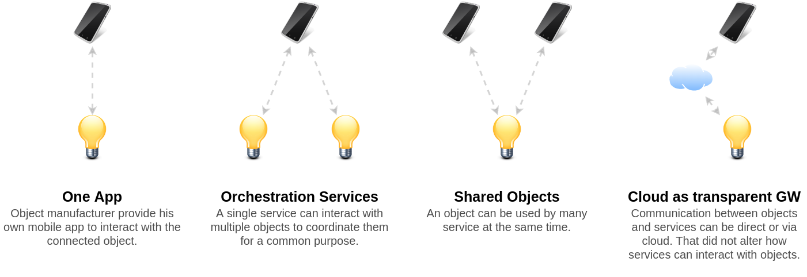

# IoT Solutions

IoT world opens many possibilities to modern sectors like Home Automation,
Factory 4.0, Smart Cities, etc... 
All those possibilities will be released in form of IoT Solutions.

The JOSP Project provide all tools to compose JOSP Solutions and create their
components. JOSP Solutions are IoT Solutions based on the JOSP EcoSystem.

To be considered an IoT Solution, it must always include at least 3 elements: a
connected object, some logic/function that define how interact with the object
and one or more user interfaces. Obviously, IoT Solutions can handle tens or
hundreds of objects and different user interfaces depending on user's role.

In the [JOSP EcoSystem](ecosystem.md), objects are represented by [JOSP Objects](objects_integration.md)
and, the logic and user interfaces elements from an IoT Solutions are merged in
a single component the [JOSP Service](service_integration.md). Or rather, the logic element can
contain or not the user interface. 
Let's proceed with an example. 
In a SmartHome environment, many smart features are provided via object's mobile
apps (user orchestrate objects via their mobile app as user interface). The same
objects, can be also used by another service that analyze home consumption. In
this case, the service collects and analyze data from objects in a background
process (like a cloud task). Once the service processed the data and prepared
analytics results, it can show them to the user via a web dashboard (user just
visualize the analytics reports, without interacting directly with objects).

**There are endless possible IoT Solutions, each one of them, depending on
particular user's need.** 
The set of all solutions, including their components, represents their own IoT
world for each user. Just like, the set of installed software and favorite web
services represent the digital world of today's users. Users continue to use the
usual software or install new apps as they always have, while the various updates
will introduce new IoT features step by step.

Depending on where the user is or what he wants to do, he has the ability to use
different JOSP Services and interact with different JOSP Objects. For example,
when he is at home and want to dimmer a lamp, he can use a mobile apps to manage
their smart lights. At the same time other smart devices can be activated from
pre-registered rules by a home automation service running in background. Even,
when the user move to the office, he can still use the same mobile app to manage
office lights and, probably, he will need to use specific JOSP Service to 
accomplish his job. 
All the user needs to do is to register his smart objects as JOSP Objects, then
he can choose to download a JOSP Service as mobile app from his favourite app store.
User can also install a JOSP Service on his PC as a downloaded software from internet.

 

These advantages are not only appreciable in the smart home sector, but also in
others like Factory 4.0, Smart Cities, Smart Agriculture, etc... Think about a
worker entering the factory in the morning, he can pass the security checks and
register the entrance at the same time. The Security Access and the HR Management
systems can use the same NFC reader to identify who wants to open the turnstile
and the worker to start working time. 

The [JOSP Project](/README.md) provides also a set of tools to integrate different
gateways, protocols and standards such as many other kinds of connected objects.
On other side, it provides also generic JOSP Service for multiple platforms
(mobile, web...) that can be used as simple Monitor and Control services with
any JOSP Objects.

## Solution A
## Solution B
## ...

Object integration level \
NoCloud/Cloud \
Cloud Private/Shared \
Network architectures \
...
