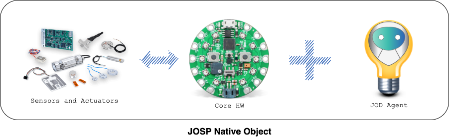
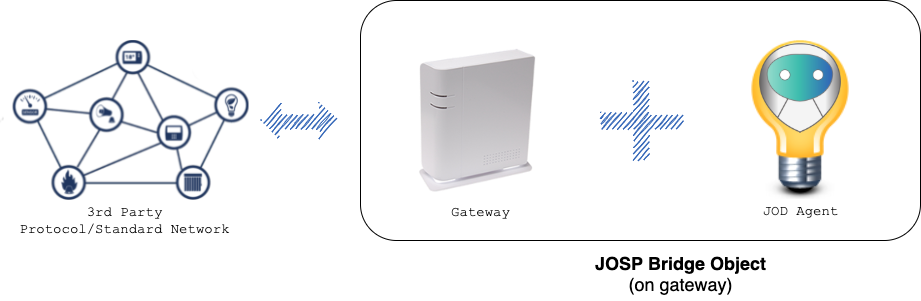
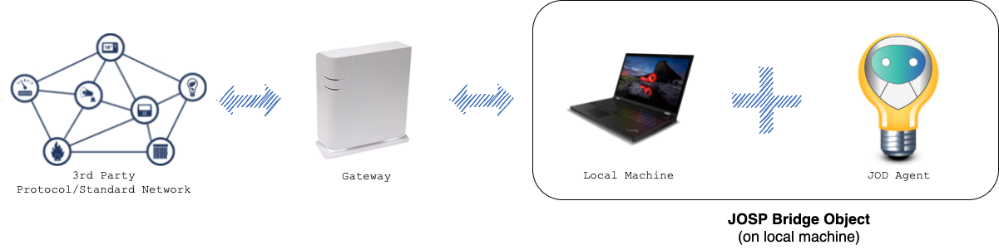
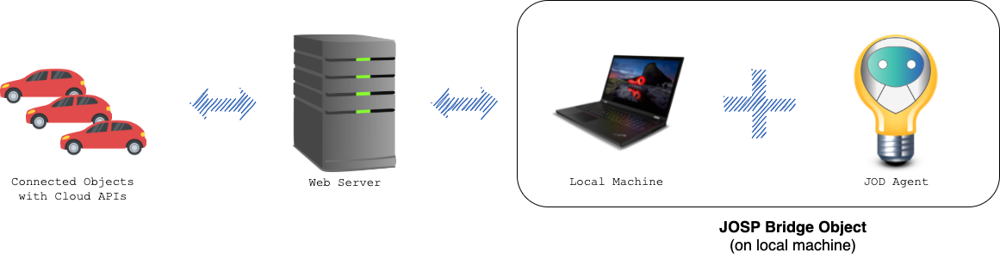

# What object can be represented as JOSP Objects?

The JOSP Protocol and all the JOSP EcoSystem are designed to handle almost any
kind of object and many more stuffs.

The most **basic representation is a physical object** that can be exposed as a
single JOSP Object. This JOSP Objects expose all object's features (switch on/of,
regulate volume, env temperature...) to available JOSP Services. 

Otherwise, the JOSP Object can represent **a set of physical devices connected
together via a 3rd party protocol/standard**. The JOSP Object can represent
anyone of the connected devices as a group of device's features.

Finally, a JOSP Object can be **a web service**. For example a web page or a 3rd
party cloud application. The JOSP Objects can send and receive HTTP(s) requests
according to the object's features.

All JOSP Objects are composed at least from a HW and SW components. 
The hardware can be different depending on the object's nature. Sometimes it's
integrated in the object itself, other times it must be installed on a local
machine. Anyhow, there must be a HW component that can be run the software
required by the JOSP Object. 
Each JOSP Object require different software configuration. To keep it simple,
the JOSP project provides tools to create preconfigured JOSP Objects the JOD
Distributions. End users can download and install those distributions on their
devices and connect objects autonomously.

So for each object's type we can identify **where install and run the JOD Agent**
or the corresponding JOD Distribution. 
Here the hardware and software setups supported by the JOSP Object. 

---

## JOSP Object Native

**Physical JOSP Objects** can be bought or (for more expert users) built following
the maker's instructions. Those objects integrate all components HW and SW; and
they only need to be connected to electricity.

A Native JOSP Object HW layer is composed by a CoreHW (normally an SBC) and a
set of sensors/actuators.

The CoreHW is the main HW component that run the JOD Agent and execute the
hardware firmware. Any kind of [Single-Board-Computer](https://en.wikipedia.org/wiki/Single-board_computer)
can be used as a CoreHW. It must support the JOD Agent (require the Java Virtual
Machine) and the hardware firmware.

When executed the JOD Agent use the HW firmware to communicate with sensors and
actuators. On the other side use the IP network to expose the JOSP Object to the
JOSP EcoSystem.

⏩ Once they are [powered on](2_poweron_object.md), you can register them on your
  JOSP EcoSystem and start interacting with them.

---

## JOSP Object Bridge

Many objects are already connected, but they are **using different protocols or
standards**. Almost all protocols require the use of a gateway. Sometimes they
call him hub, sometimes bridge/webserver/router/access-point... 

Typically, those gateways act as a bridge between the protocol/standard and IP
network. They can be used by mobile apps to communicate with home appliances
(smart home protocols), or even by process control software to control industrial
machines.

To **integrate all objects connected to a gateway**, you can represent that
gateway as a JOSP Object. That means, the resulting JOSP Object contains a
group of features for each object connected to the gateway. For example, if the
gateway is a ZigBee bridge, the resulting JOSP Object contains a group of
features for each object connected to the ZigBee bridge.

When it is possible install the JOD Agent directly on the gateway, it's the best
option. So each time you power on the gateway, it starts also the JOD Agent that
expose the JOSP Object.

Often, gateways are protected and do not allow installation of other software.
In those cases we need a local machine where run the JOD Agent. This machine must
be on the same IP network of the gateway. 
For testing purpose, the machine can be also your personal computer. For daily
usage, we suggest to set up a local server to handle all your JOD Agents.

⏩ Once the JOD Agent was [started](3_run_distribution.md), you can register them on
your JOSP EcoSystem and start interacting with them.

---

## JOSP Object Web

It is quite common for information relating to an object / sensor to be
**available online**. For example, the operating status of a web server, or the
temperature of a public weather station.

Also, many others connected **objects can be reachable via API** calls (API are
cloud services provides by object's manufacturer for 3rd party software).

In all these cases, the objects are reachable through some cloud service. So a
JOSP Object can represent any object that can be reachable via web, like HTTP(s)
calls.

The JOD Agent must be installed on a local machine with an internet connection.
Then it translates JOSP messages in HTTP requests.

⏩ Once the JOD Agent was [started](3_run_distribution.md), you can register
corresponding JOSP Object to your JOSP EcoSystem and start interacting with it.
