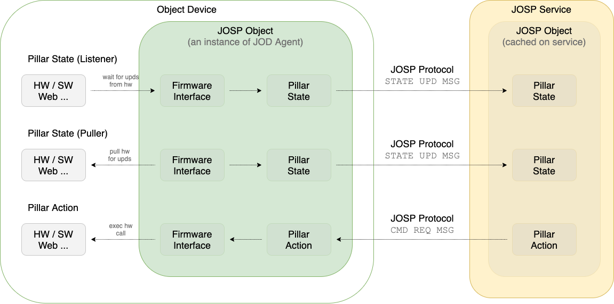
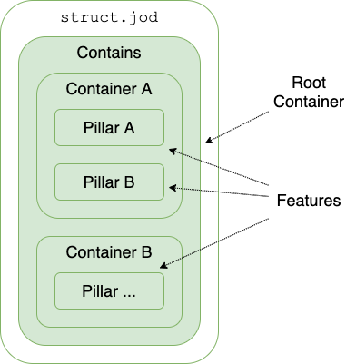

# JOD - Specs: `struct.jod`

[SPECS](../specs.md) | [IMPLS](../impls.md) | [CHANGELOG](../../CHANGELOG.md) | [TODOs](../../TODOs.md) | [LICENCE](../../LICENCE.md)

A JOSP Object expose to the JOSP EcoSystem all features defined in his structure.

The **object's structure** contained in the ```configs/struct.jod``` file is a
hierarchical list of the features that the JOD Agent must expose to the JOSP EcoSystem.<br/>
Each feature can be defined as a State or an Action. States can wait for firmware's
value updates and update JOSP Services on value changes. Actions are like States,
but they can also receive commands requests from JOSP Services and translate those
command to firmware calls.<br/>



States and Actions, depending on what they must expose to the JOSP EcoSystem,
they can be of different types. We call this types **Pillars**.<br/>
For example if you are designing a JOD Distribution for a connected lamp, probably
you would expose the On/Off control as object's feature. To do that, you must add
a ```BooleanAction``` pillar to the object's structure. Then configure it as
"On/Off switch".<br/>
Otherwise, if the feature that you would expose is like the environment temperature,
then you must add a ```RangeState``` pillar to object's structure.<br/>
More details and examples on [Pillars](pillars.md) and [Workers](workers.md)
chapters.

Pillars configuration allow the JOD Agent to **expose the feature to JOSP Services**
exactly as you desire, and on the other side, **use the right firmware calls** to interact with external world like hardware sensors and actuators. The JOD Agent is very flexible and can interact, not only with hardware peripherals, but also with other software, websites or anything you require. Pillars can be configured to use different firmware interfaces depending on your needs.

---

## Object info

Object's info are related to JOSP Object implementation and are contained in the
```struct.jod``` file as part of the object's structure.

You can use this info to define your JOSP Object and help JOSP Service developers
find and use it.

From JOSP Service developers prospective, object's info are intended as model
info exposed by JOSP Objects; and can help them to identify connected objects.

* ```model```: unique name that identify your JOSP Object type
* ```brand```: unique name that identify yourself or hardware manufacturer
* ```descr```: sort object description
* ```descr_long```: detailed object description
* ```contains```: the object's structure, contains is the root container

Here an example of a complete object's info section in a ```struct.jod``` file:

```json title="JOD PC Mac/configs/struct.jod distribution"
{
    "model": "MacOS JOSP Object",
    "brand": "Apple Inc.",
    "descr": "A MacOS computer that expose his features to JOSP's services.",
    "descr_long": "This object can be used to control remotely functions as system volume, lightning, keyboard, mouse, etc...",
    "contains": {
      // Object's structure
  }
}
```

---

## Object structure

Object's structure is a hierarchical list of object's features.

In the ```struct.jod``` file, each feature is defined as a Pillar element.
Pillars can be contained in Container elements. The ```contains``` element from
```struct.jod``` files is the root container of the object's structure. Container
can contain other containers and create multi-level hierarchy.



Here an example of complete ```struct.jod``` file:

```json title="MyDist/configs/struct.jod"
{
    "model": "My Distribution",
    "brand": "MyMyselfAndI",
    "descr": "A _full_ featured IoT Object that expose _all_ data and _all_ remote controls to the JOSP EcoSystem",
    "descr_long": "Long and more detailed configs",
    "contains": {
        "Container A" : {
            "type": "JODContainer",
            "contains": {
                "Pillar A" : {
                    "type": "PillarType",
                    // PillarType specific configs for Feature A
                },
                "Pillar B" : {
                    "type": "PillarType",
                    // PillarType specific configs for Feature B
                }
            }
        },
        "Container B" : {
            "type": "JODContainer",
            "contains": {
                "Pillar ..." : {
                    "type": "PillarType",
                    // PillarType specific configs for Feature ...
                }
            }
        },
  }
}
```

<br/>
<br/>

Please customize the main ```contains``` section according to the JOSP Object's
structure you would expose.<br/>
Detailed pillars configs can be found in the [next](pillars) section.
